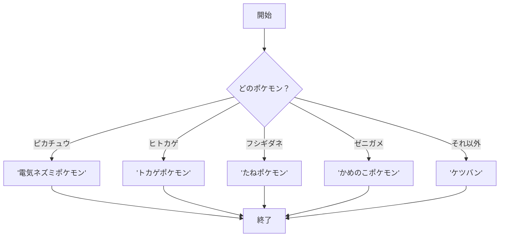
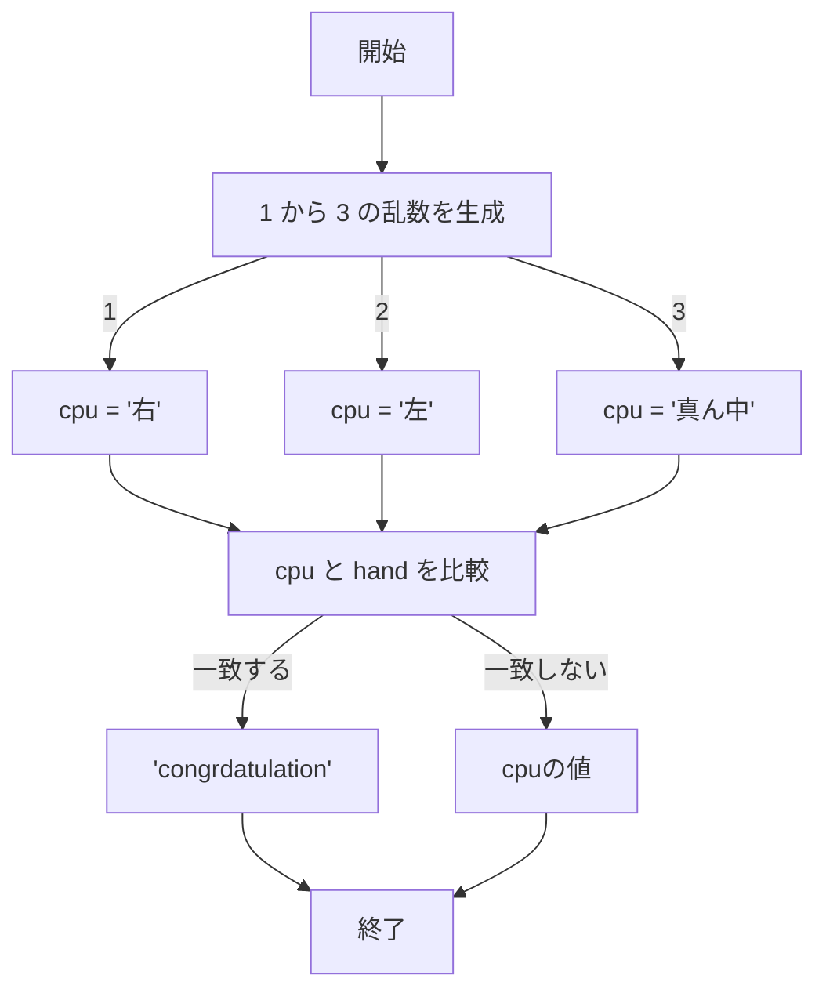

# webpro_06
2024/10/29
## このプログラムについて
## ファイル一覧
ファイル名 | 説明
-|-
app5.js | プログラム本体
public/select.ejs | 選ぶゲームを表示するプログラム
view/pokemon.ejs | ポケモン図鑑を表示するプログラム

```javascript
console.log("helllo");
```
## ポケモン図鑑の機能
入力したポケモンの説明を表示する．
対応するポケモンはヒトカゲ，ゼニガメ，フシギダネ，ピカチュウ．
選択しなかった場合はケツバンと表示する．


## ポケモン図鑑を使う手順
1. webサーバーとしてapp5.jsを起動する(http://localhost:8080/pokemon)
1. webブラウザでlocalhost:8080/pokemonにアクセスする

1. ポケモンの名前と対応するボタンをクリック


## ポケモン図鑑を実装する手順


## 宝探しゲームの機能
3つの宝箱があり，1つだけお宝が入ってる．
画面に表示される箱のうちあたりのものを右，真ん中，左から選ぶ．
外れたらお宝があった場所が表示される．

## 宝探しゲームをする手順
1. webサーバーとしてapp5.jsを起動する(http://localhost:8080/select)

1. webブラウザでlocalhost:8080/selectにアクセスする
1. 右，真ん中，左から対応するボタンをクリック

## 宝探しゲームを実装する手順
