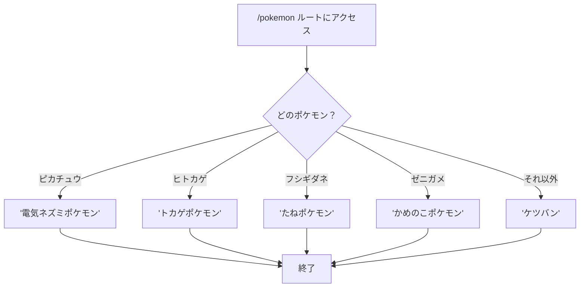
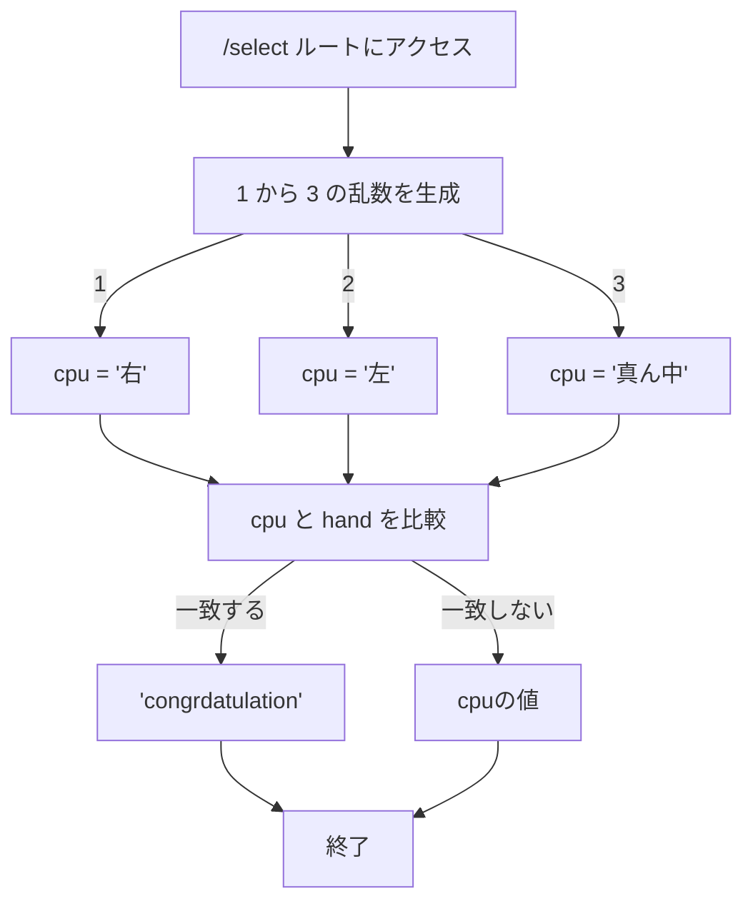

# webpro_06
2024/10/29
## このプログラムについて
## ファイル一覧
ファイル名 | 説明
-|-
app5.js | プログラム本体
public/select.ejs | 選ぶゲームを表示するプログラム
view/pokemon.ejs | ポケモン図鑑を表示するプログラム

```javascript
console.log("hello");
```
## ポケモン図鑑を実装する手順
1. app5.jsを起動する

2. webブラウザでlocalhost:8080/public/pokemon.htmlにアクセスする

1. ポケモンの名前を入力

1. pokemonルートにアクセス

1. 入力されたポケモンに応じた解説を返す(対応していないポケモンが入力されたらケツバンと返す)



## 選ぶゲームを実装する手順
1. app5.jsを起動する

2. webブラウザでlocalhost:8080/public/select.htmlにアクセスする

1. 右，真ん中，左から選ぶ

1. selectルートにアクセス

1. 入力された選択が合ってたらcongratulation(外れたら答え)
