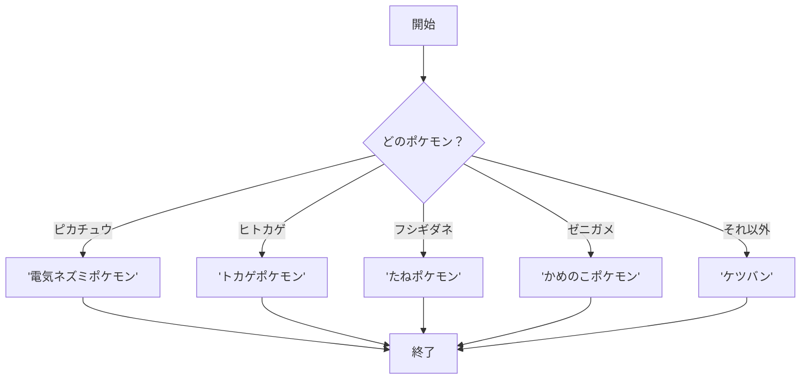
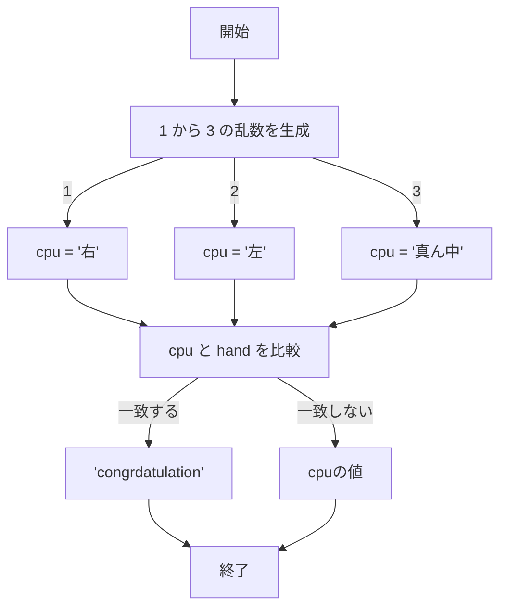

# webpro_06
2024/10/29
## このプログラムについて
## ファイル一覧
ファイル名 | 説明
-|-
app5.js | プログラム本体
public/select.ejs | 選ぶゲームを表示するプログラム
view/pokemon.ejs | ポケモン図鑑を表示するプログラム

```javascript
console.log("hello");
```
## ポケモン図鑑の機能
入力したポケモンの説明を表示する．
対応するポケモンはヒトカゲ，ゼニガメ，フシギダネ，ピカチュウ．


## ポケモン図鑑を使う手順
1. app5.jsを起動する(https://github.com/togabjto/webpro_06/blob/main/app5.js)

1. webブラウザでlocalhost:8080/public/pokemon.ejsにアクセスする(https://github.com/togabjto/webpro_06/blob/main/views/pokemon.ejs)

1. ポケモンの名前を入力


## ポケモン図鑑を実装する手順


## 選ぶゲームの機能
あたりのかっこを選ぶ．
画面に表示されるかっこのうちあたりのものを右，真ん中，左から選ぶ．

## 選ぶゲームをする手順
1. app5.jsを起動する(https://github.com/togabjto/webpro_06/blob/main/app5.js)

2. webブラウザでlocalhost:8080/public/select.ejsにアクセスする(https://github.com/togabjto/webpro_06/blob/main/views/select.ejs)

1. 右，真ん中，左から選ぶ

## 選ぶゲームを実装する手順
