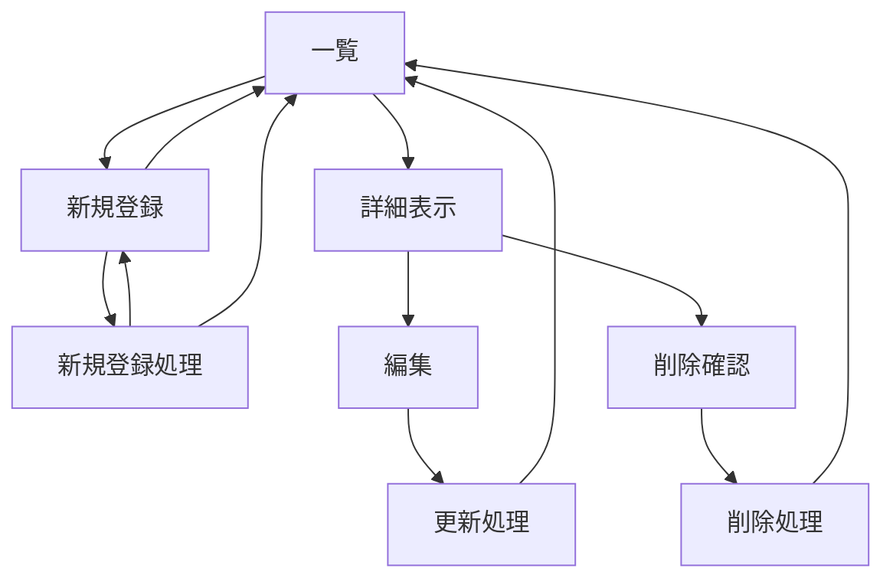

```mermaid
graph TD;
    %% ノード定義
    List[一覧<br>]
    New[新規登録<br>]
    NewProc[新規登録処理<br>]
    Detail[詳細表示<br>]
    Edit[編集<br>]
    UpdateProc[更新処理<br>]
    DelConfirm[削除確認<br>]
    DelProc[削除処理]

    %% 新規登録フロー（左側）
    List --> New
    New --> List
    New --> NewProc
    NewProc --> New
    NewProc --> List

    %% 詳細・編集フロー（中央）
    List --> Detail
    Detail --> Edit
    Edit --> UpdateProc
    UpdateProc --> List

    %% 削除フロー（右側）
    Detail --> DelConfirm
    DelConfirm --> DelProc
    DelProc --> List
```